# Trybe Project Playground Functions 29/06/2021
 

  

 

## Habilidades

- Escrever códigos em JavaScript que usam variáveis e tipos primitivos;
- Utilizar conceitos da linguagem como a tipagem dinâmica e operadores lógicos/aritméticos/de atribuição no seu código;
- Criar códigos que usam estruturas condicionais, como o if/else ;
- Manipular arrays (listas);
- Utilizar o comando for ;
- Quebrar grandes problemas em pequenos;
- Utilizar a lógica de programação na resolução de problemas;
- Manipular objetos;
- Utilizar o comando for/in ;
- Utilizar funções para organizar e estruturar o seu código.

## Desenvolvimento
Funções seguindo os requisitos especificados para o correto comportamento de cada uma delas.

 

  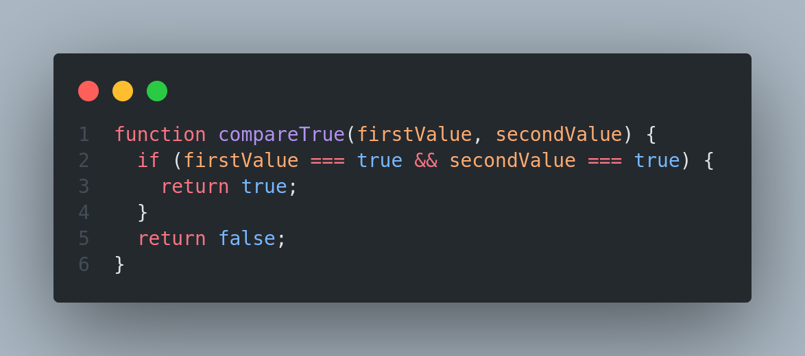
  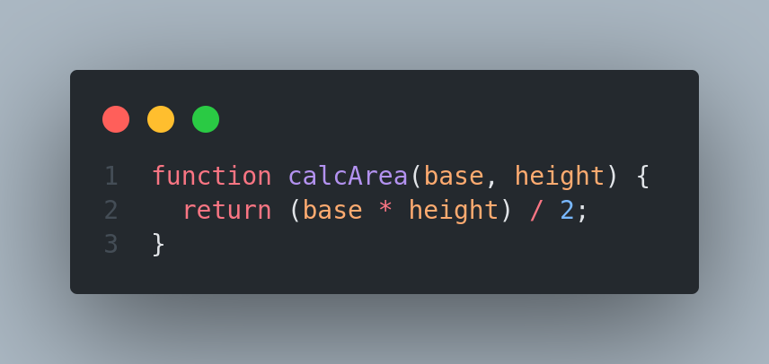
  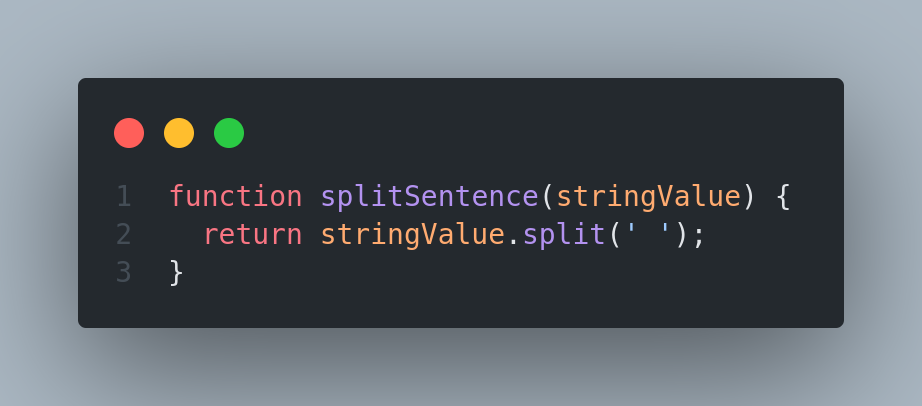
  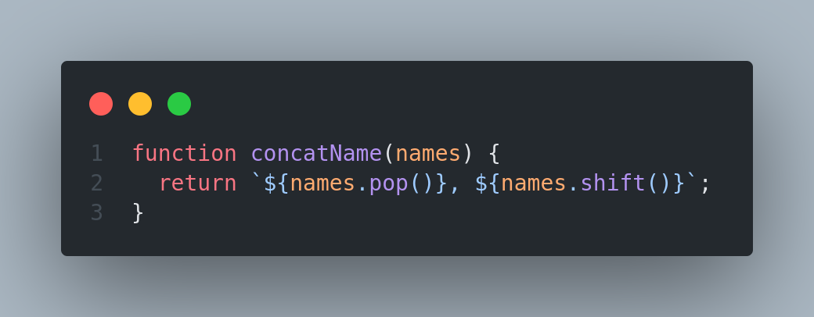
  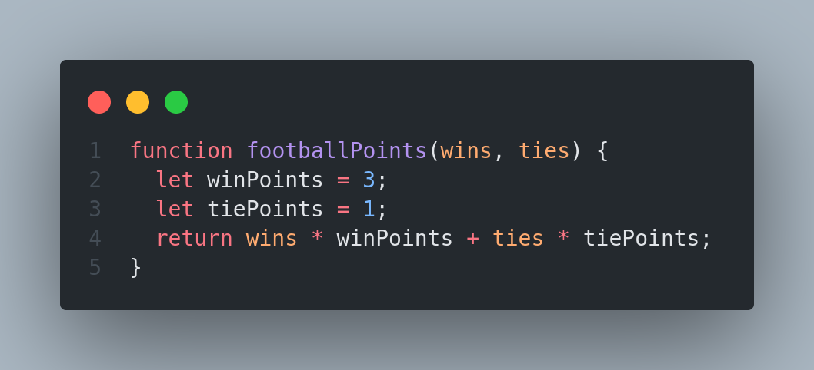
  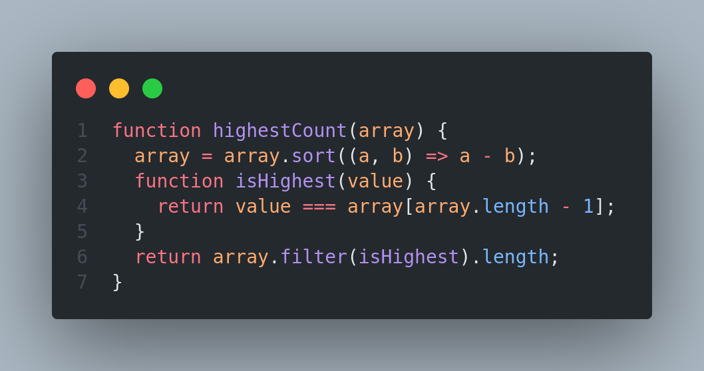
  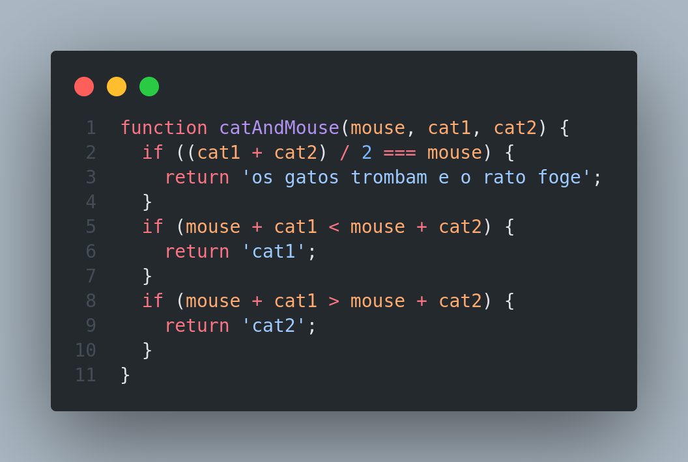
  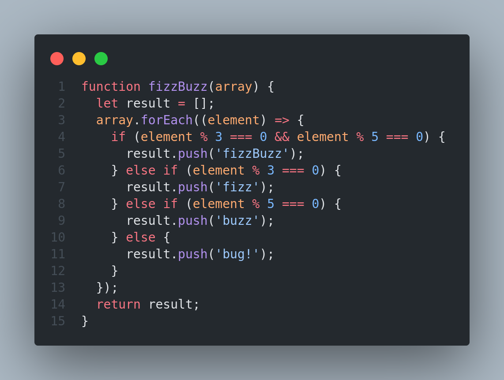
  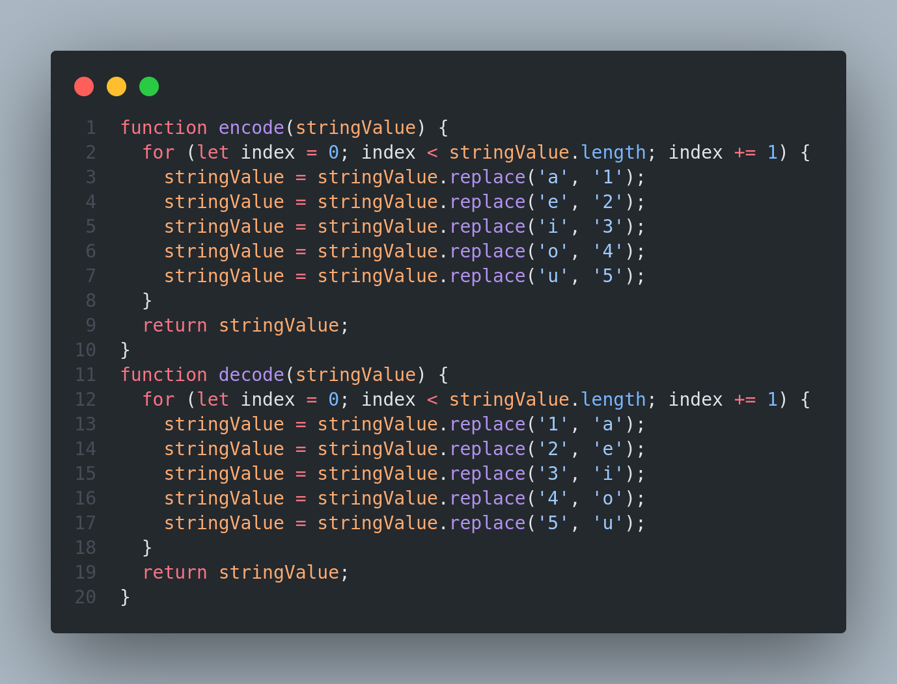
  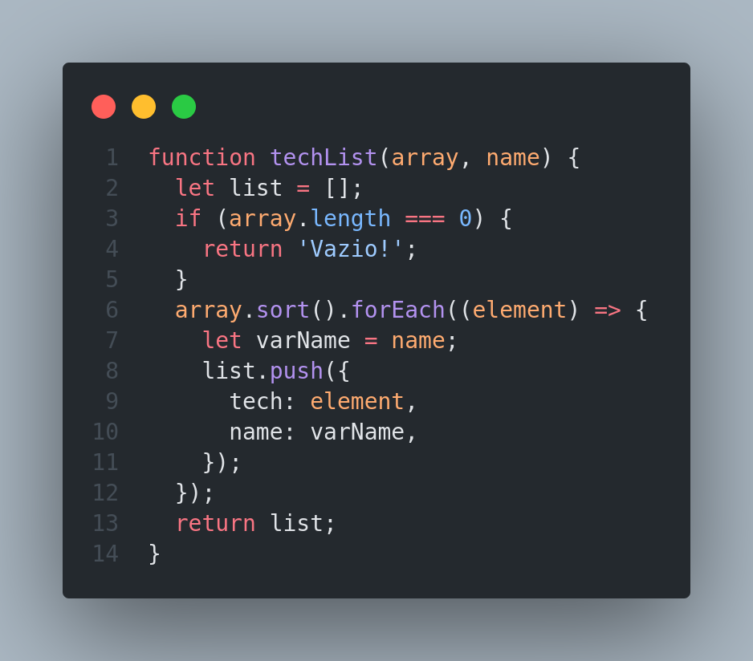
  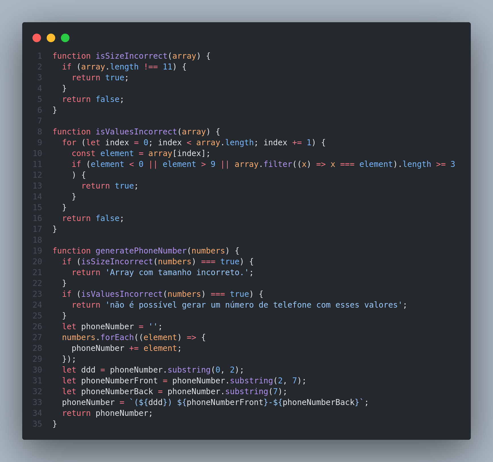
  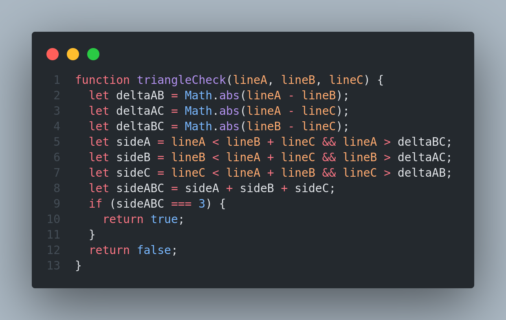
  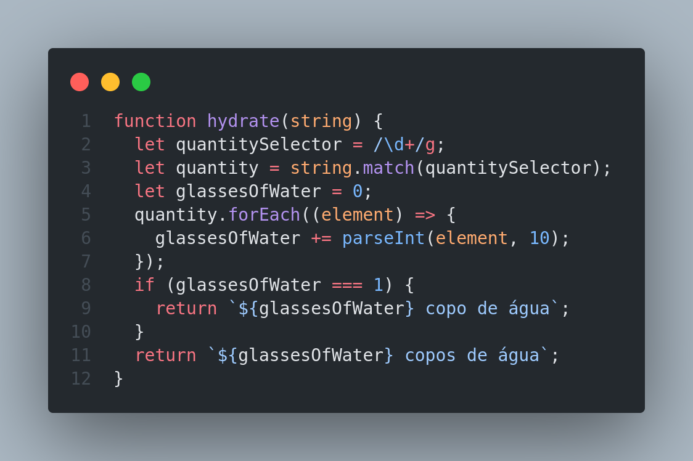

## Resultados

- `1` dia de projeto;
- `13` requisitos;
- Percentual de cumprimento de requisitos obrigatórios `100.00%`;
- Percentual de cumprimento de requisitos totais `100.00%`.

